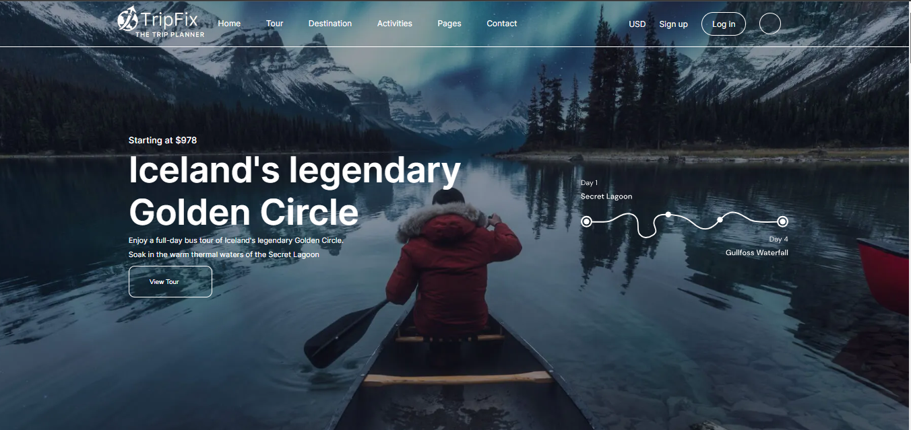

## TripFix-TheTripPlanner

TripFix is a single-page web component designed to provide a sleek and dynamic user experience for exploring travel options. It incorporates a header, navbar, main, footer, an background image with overlay text and proper hovering and scaling effect to make the design look lively, smooth and beautiful. The design is crafted using HTML, CSS, and where sass has been used to generate the styles.css file. The web page replicate a figma design document, focusing on to make it look elegant and beautiful for large, xtra-large and ultra-large screens. 

### Deployed Link

[Live Demo](https://tripfix.netlify.app/)

### Screenshots

#### Desktop View
##### header 

## Features

- **Header Navbar**: Header consists navbar and below it a background image with overlay text on it.
- **Dynamic Design**: A single-page component with figma design layout for large and ultra large screens device, ensuring a seamless user experience.
- **Image with Overlay Text**: An image positioned in the Header just right below navbar, with translucent overlay text for added visual appeal.
- **Trending sections and Interactive Cards**: Contains image cards with information about the place and have scaling effect upon hovering.
- **Featured Trips and Travel article**: Contains image cards with information about the place and have scaling effect upon hovering.
- **Footer**: Footer have proper height to accomodate all the links including social media and having good choice of font and color styling to enhance user experience.

## Tech Stack

- **HTML**: Provides the structure and content for the web page.
- **CSS**: Handles the UI and styling, ensuring an appealing visual presentation.
- **Sass**: Implements Sass compiler to generate the css styling.

### Design Elements

1. **Media Queries:**
   Media queries are utilized to ensure the website's responsiveness across various screen sizes. By adjusting the layout and styling dynamically, the website offers an optimal viewing experience on different devices.

2. **Scaling and Hovering**
   Scaling and Hovering effect are employed to create captivating transition within the website. By defining specific effects enhance the user interaction, providing a seamless browsing experience.

3. **Overlay:**
   The overlay feature is integrated to enhance the visual presentation of images. By adding a translucent layer over images, overlay improves readability and focus, making text content more prominent and appealing.

6. **Fonts & Icons:**
  Integrates Google Fonts and FontAwesome icons for enhanced typography and visual elements. By leveraging these resources, the website achieves a modern and visually appealing design, improving readability and user engagement.   

## How to Use

To run this project locally:

1. Clone this repository to your local machine.
2. Open the `index.html` file in your preferred web browser.
3. Explore the TripFix experience right from your device.

## Contributors

<a href="https://github.com/aniyant">sunny kumar</a>    <a href="https://github.com/Akash2304">Akash Rajpoot</a>    <a href="https://github.com/mr-taqi">Syed</a>
         <a href="https://github.com/rajatsah95">rajat kumar</a>     <a href="https://github.com/Chaitali124">chaitali</a>    <a href="https://github.com/uk70">vishal</a>
   

## License

This project is licensed under GNU GENERAL PUBLIC LICENSE - see the [LICENSE](LICENSE) file for details.

## Acknowledgments

- Inspired by the beauty of travel and exploration.
- Special thanks to the supportive community at [TripFix].
